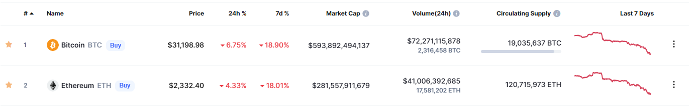

- #推特 Vannevar Bush的自传《Pieces of the Action》 [@Ben_Reinhardt](https://twitter.com/Ben_Reinhardt/status/1222898745815126017)
- #网站 [kottke.org](https://kottke.org/22/05/announcement-im-going-to-miss-you-but-i-am-taking-a-sabbatical)网站作者发公告称要暂停更新一段时间，kottke.org已经更新了24年，主要是分享一些互联网上的有趣内容。
- #工具 [tweetdelete](https://tweetdelete.net/)删除推文，保护隐私。
- #工具 [sunday.fm](https://sunday.fm/)网站本质上只是一个YouTube 视频的播放按钮，它可以持续播放轻松的音乐，非常适合学习或工作。
- #区块链 比特币、以太坊暴跌，比特币跌破跌破30,000 美元。能源价格上涨、俄罗斯入侵乌克兰、通货膨胀飙升和中国新的 COVID 封锁的担忧。 {:height 110, :width 626}
- #太阳朋克 #刘易斯·芒福德 [From Cyberpunk to Solarpunk: Technics and the Cities of the Future](https://bluelabyrinths.com/2022/01/10/from-cyberpunk-to-solarpunk-technics-and-the-cities-of-the-future/)
	- 从赛博朋克到太阳朋克：技术与未来城市
	- 刘易斯·芒福德（Lewis Mumford）:Authoritarian and Democratic Technics；《城市发展史》（The city in history）
- #视频 1989 年 CBC 梅西讲座，“技术的真实世界” [The Real World of Technology](https://www.cbc.ca/radio/ideas/the-1989-cbc-massey-lectures-the-real-world-of-technology-1.2946845)
- #元宇宙 沃尔玛设想在#Metaverse 中购物的方式，这是一家名为Mutual Mobile的公司为SXSW 2017制作的VR演示。 https://twitter.com/DigitalisHomo/status/1478094074909540354
	- [This is how Walmart envisions Shopping in the #Metaverse.mp4](../assets/This_is_how_Walmart_envisions_Shopping_in_the_#Metaverse_1652185405871_0.mp4)
	- 在#元宇宙 购物会是什么样子？https://twitter.com/3BodyProblem/status/1478096057607208960
- #元宇宙 [Even Walmart Is Worse in the Metaverse](https://www.gawker.com/tech/i-do-not-want-to-go-to-walmart-in-the-metaverse) 甚至沃尔玛在元宇宙中都更糟糕，我更喜欢现实生活而不是元宇宙。
  :LOGBOOK:
  CLOCK: [2022-05-10 Tue 20:40:02]--[2022-05-10 Tue 20:40:03] =>  00:00:01
  :END:
	- 试图向我们推销虚拟现实的目的是什么？也许，就像 NFT 一样，它是一种愤世嫉俗的现金攫取，吸引了那些认为科技领域的下一件大事自然而然、毫无疑问是可信的投资者的大笔资金。但是，如果有更黑暗的东西在起作用，那就是现实世界将变得如此不适合居住，被疾病和气候变化所破坏，以至于元宇宙将成为唯一的替代解决方案——即便如此，我们将如何处理它？去沃尔玛？这是想象力的匮乏，还是早期尝试让我们相信这个笨拙的装置可以让我们在一切都崩溃时恢复某种常态？
- #句子 心理学家卡尔·荣格（Carl Jung）认为，孤独感“不是来自于有没有人，而是来自于无法传达对自己来说似乎很重要的事情，或者来自于持有他人认为不可接受的某些观点。” （not come from having no people about one, but from being unable to communicate the things that seem important to oneself, or from holding certain views which others find inadmissible.）
- #web3 [Metalabels](https://metalabel.xyz/about) 是一群以共同身份为共同目的而工作的人，他们专注于发布——不同的公共作品，传达和体现他们的目标。当我们将标签视为一个类别时，我们可以观察到一些核心功能。标签：
	- 确定代表和促进的观点或目的
	- 签署并支持能够实现其目的或 POV 的人
	- 将资源（资金、促销支持、社会影响力、背景）用于发布和符合其目的的想法，在更广泛的文化中建立这些理想
	- [Yancey Strickler在以太坊会议上介绍Metalabels（2022）]（https://www.youtube.com/watch?v=oYAIqiyoC0c）
- #书 #社区 [Don't be scared, you're not the only one](https://ideaspace.substack.com/p/dont-be-scared-youre-not-the-only?s=r) 不要害怕，你不是唯一一个
	- 《增长的极限》麻省理工学院的四位科学家建立了一个关于世界人口、资源、污染和增长率的计算机模型，并预测了它们在未来将如何发展。他们的模型描绘的画面是可怕的：经济和人口增长的终结，以及可能在 21 世纪某个时候出现的社会崩溃。
	- 彼得·泽汉（Peter Zeihan）的一本新书《Disunited Nations》是这样描述我们的：我们站在以冷战开始的时代的尽头。它将不像21世纪初的混乱或50年代的原始潜力，而更像是19世纪70年代的战斗和流离失所在30年代的经济背景下的灾难性组合。它。会。吮吸。对刚刚结束的时代的残羹剩饭的疯狂争夺。与过去几十年的安全和财富相比，它可能看起来像字面上的世界末日。但一个时代的结束并不等同于历史的结束。新的东西正在到来。从历史上看，这个东西比美国人创造的任何东西都要 "正常 "得多。只要记住，"正常 "远远不是 "舒适 "的同义词，更不是 "有利 "的。(We stand at the end of the era that began with the Cold War. It’ll be less like the messiness of the early 2000s or the raw potential of the 1950s, and more a disastrous combination of the battle royales and displacements of the 1870s against the economic backdrop of the 1930s. It. Will. Suck. A mad scramble for the scraps of the era just ending. Compared with the safety and wealth of the past several decades, it may seem like the literal end of the world. But the end of an era isn’t the same as the end of history. Something new is coming. Something that, historically speaking, is far more “normal” than anything the Americans created. Just keep in mind that “normal” is far from synonymous with “comfortable,” much less “favorable.”)
	- 《Collective Courage: A History of African American Cooperative Economic Thought and Practice》，讲述了黑人在面对数百年的种族主义时利用合作社来创造复原力和集体力量。较大的系统积极反对美国黑人，因此他们创建了自己的系统。当事情变得艰难时，人们会团结起来。大萧条时期创建的合作社比其他任何时候都多。
- #视频 [Donella Meadows Down to Earth](https://www.youtube.com/watch?v=bxowxs22jFk)
	- 达纳·梅多斯(Donella Meadows)于 1993 年在哥斯达黎加举行的可持续发展会议上发表的“Down to Earth”演讲。
	- 达纳·h·梅多斯(Donella H. Meadows)是一位开创性的环境科学家、作家、教师和农民，被广泛认为走在了她所处时代的前面。她是世界上最重要的系统分析师之一，也是颇具影响力的《增长的极限》一书的主要作者。她是达特茅斯学院环境研究的兼职教授，可持续发展研究所的创始人，国际资源信息中心网络的联合创始人。
- #人工智能 [AI & The Future Of Civilization](https://www.edge.org/conversation/stephen_wolfram-ai-the-future-of-civilization) 人工智能与文明的未来（与斯蒂芬·沃尔夫勒姆[Stephen Wolfram]的对话）
	- 我感兴趣的一件事是我们如何将目标传达给 AI。我们如何与 AI 对话？我的基本结论是它是一种混合物。人类的自然语言在某种程度上是好的，并且已经发展到描述我们通常在世界上遇到的东西。自然界中存在的东西，我们选择在世界上建造的东西——这些都是人类自然语言进化来描述的东西。但是世界上存在很多人类自然语言还没有描述的东西。即使我们的人工智能系统可能有效地找到这些描述，我们自己也没有办法说出这些。
	- 当大多数人都可以编写代码时，世界会是什么样子？
	- 未来人类的衍生品最终会选择与自己做什么？潜在的坏结果之一是他们一直在玩电子游戏。文明的未来是每个人都在玩电子游戏。可以这么说，他们正在玩未来的魔兽世界。
- #斯图尔特·布兰德 [The Origins Of ‘Planetary Realism’ And ‘Whole Earth’ Thinking](https://www.noemamag.com/the-origins-of-planetary-realism-and-whole-earth-thinking/)  “地球现实主义”和“全球”思维的起源
	- 斯图尔特·布兰德：当 Jim Lovelock 和 Lynn Margulis 提出盖亚假说在 70 年代初，我当时正在编辑的 CoEvolution Quarterly 是第一批印刷它的地方之一，然后印刷了关于它的辩论。当时，许多生物学家对盖亚假说持怀疑态度，甚至怀有敌意。加拿大一位名叫 W. Ford Doolittle 的科学家给我写信说，“盖亚是一个有趣的想法和理想主义，但它在进化方面毫无意义，因为如果地球正在适应，它在适应什么？关系到？你不能拥有一个个体的物种。健身只对其他人有意义。但有了盖亚，就没有其他人了。”
- #书 《盖娅：地球生命的新视野》
	- “盖亚假说” （Gaia hypothesis）认为生命通过与地壳、海洋和大气相互作用，尤其是大气的构成和气候变化，对地球表层产生了稳定的影响结果。有了这样一个自我调节的过程，生命就能够在这样的条件下生存下来，而这种条件本来可以在没有自我调节的行星上令生命不复存在。人类造成的气候变化很大程度上是我们燃烧化石燃料释放二氧化碳的结果，而这只是生命影响地球系统的最新方式而已。
- #区块链 [Balaji Srinivasan: Technology Will Lead to a Borderless World](https://reason.com/podcast/2018/02/28/balaji-srinivasan-tech-borderless-world/) Balaji Srinivasan：技术将引领无国界世界
	- VR 与虚拟货币的特殊组合将是一件巨大的事情。
	- 比特币和其他加密货币是创造无国界世界的另一项关键技术，因为它们可以在不依赖受信任的中介的情况下在世界任何地方转移价值。
- #书 [The Sovereign Individual](https://book.douban.com/subject/1919172/)《主权个人》
	- 1997年春天，在托尼·布莱尔上台前不久，英国泰晤士报的前编辑、著名的欧洲怀疑论者雅各布的父亲威廉·莫格，出版了一本声称能够看到世界未来的书，叫《主权个人》（the sovereign individual）。